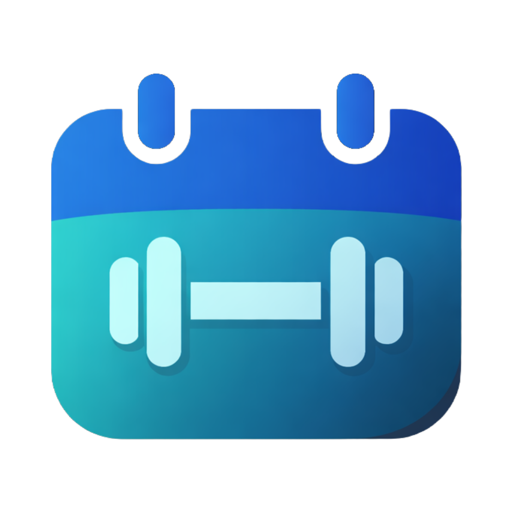

<div align="center">
  
  <h1>W8ly</h1>
  <p><em>Aplicación web/mobile para planificar y registrar tus entrenamientos de fuerza de forma offline</em></p>
</div>

## 📱 Características

- **Planificador semanal**: Organización por días con drag & drop, etiquetas personalizadas e interfaz estilo Trello
- **Biblioteca de ejercicios**: Más de 50 ejercicios pre-cargados con filtros por grupo muscular y búsqueda rápida
- **Modo entrenamiento activo**: Timer integrado, registro de progreso y control de tiempo de descanso
- **Historial y estadísticas**: Resumen post-entrenamiento, registro histórico y tendencias de progreso
- **Configuración personalizada**: Ajustes predeterminados, unidades de medida (kg/lb) y tema oscuro/claro
- **Offline-first**: Funciona sin internet, almacenamiento local y sin registro ni login
- **PWA instalable**: Instala la app en tu dispositivo móvil

## 🎨 Diseño

[Figma Wireframes](https://www.figma.com/design/viXZZwplbtnsQZtGhxdF0p/W8ly-Wireframes?node-id=0-1&t=OeV0bBvHbgnkQCij-1)

## 🛠️ Tecnologías

- `vite >= 5.4.11`
- `react >= 18.3.1`
- `typescript >= 5.6.2`
- `tailwindcss >= 3.4.17`
- `shadcn/ui` - Componentes UI accesibles
- `framer-motion >= 11.15.0` - Animaciones fluidas
- `react-router-dom >= 6.30.0` - Enrutamiento SPA
- `date-fns >= 3.6.0` - Manipulación de fechas
- `driver.js >= 1.4.0` - Tours guiados
- `react-hook-form >= 7.61.0` - Gestión de formularios
- `zod >= 3.25.0` - Validación de esquemas
- `recharts >= 2.15.0` - Gráficos y estadísticas
- `lucide-react >= 0.462.0` - Librería de iconos
- `sonner >= 1.7.0` - Sistema de notificaciones toast
- `next-themes >= 0.3.0` - Tema oscuro/claro
- `@tanstack/react-query` - Gestión de estado asíncrono
- `@radix-ui/*` - Primitivos UI accesibles

## 📋 Requisitos

- `Node.js >= 18.0.0`
- `npm >= 10.0.0`

## 🚀 Instalación

1. Clonar el repositorio

```bash
git clone https://github.com/dano796/w8ly
cd w8ly
```

2. Instalar dependencias

```bash
npm install
```

3. Iniciar el servidor de desarrollo

```bash
npm run dev
```

La aplicación estará disponible en `http://localhost:5173`

4. Compilar para producción

```bash
npm run build
```

## 📱 Instalación como PWA

1. Abre la aplicación en tu navegador móvil (Chrome, Safari, Edge)
2. Busca la opción "Añadir a pantalla de inicio" o "Instalar"
3. Confirma la instalación
4. Accede a W8ly como una app nativa desde tu pantalla de inicio

---

### Desarrollado por

- Daniel Ortiz Aristizábal - 000186841
- Valeria Zuluaga Alzate - 000186253

### Aplicaciones Móviles - Universidad Pontificia Bolivariana